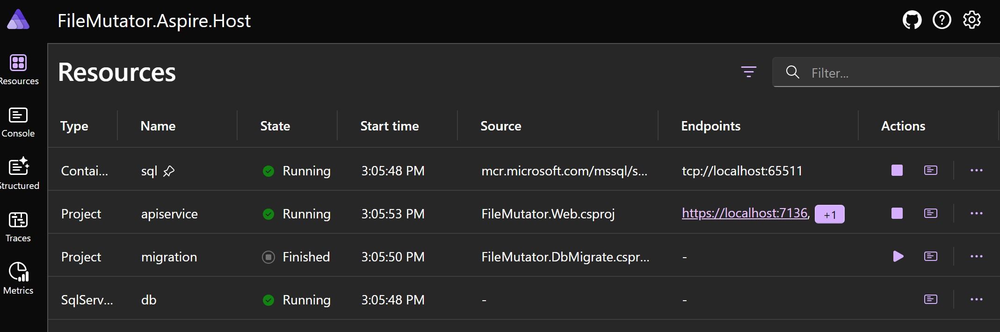
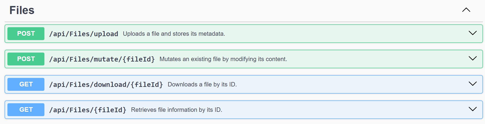

# FileMutator
Example of a small .NET API project

## Overview

The **File Mutator API** provides endpoints for uploading, modifying, downloading, and retrieving file information. It stores files in a database and allows mutation of file contents.

## Endpoints

### 1. Upload a File

**Endpoint:** `POST /api/files/upload`

Uploads a file and saves its metadata in the database.

#### Request:

- `file`: *(Form file)* The file to be uploaded.

#### Responses:

- Returns file details (`FileInfoShort`).

### 2. Mutate a File

**Endpoint:** `POST /api/files/mutate/{fileId}`

Finds a file by ID and modifies its content.

#### Request:

- `fileId`: *(GUID)* The ID of the file to be mutated.

#### Responses:

- Returns updated file details (`FileInfoFull`).

### 3. Download a File

**Endpoint:** `GET /api/files/download/{fileId}`

Retrieves a file from the database as a binary stream.

#### Request:

- `fileId`: *(GUID)* The ID of the file to download.

#### Responses:

- Returns the file as a binary stream.

### 4. Get File Information

**Endpoint:** `GET /api/files/{fileId}`

Retrieves metadata about a file.

#### Request:

- `fileId`: *(GUID)* The ID of the file.

#### Responses:

- Returns file details (`FileInfoFull`).

---
---
## Setup Instructions

1. **Clone the repository:**
   ```sh
   git clone https://github.com/flash2048/FileMutator.git
   ```
2. **Navigate to the project directory:**
   ```sh
   cd src\FileMutator.Aspire.Host\FileMutator.Aspire.Host.AppHost
   ```
3. **Restore dependencies:**
   ```sh
   dotnet restore
   ```
4. **Run the application:**
   ```sh
   dotnet run
   ```

It will run the Aspire project with all the necessary steps.


You can open the SwaggerUi page and use it.


---
 Happy coding!